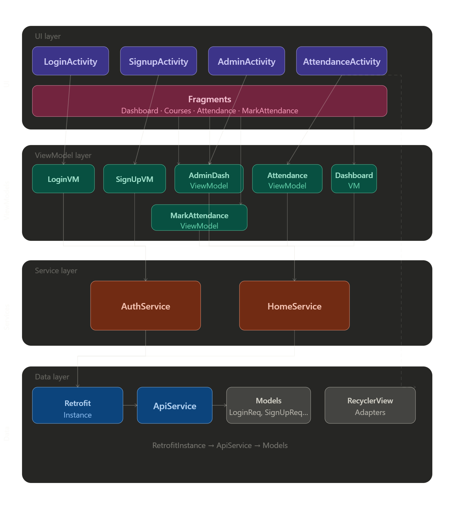

# CampusCircleApp Evaluation Preparation

## 1. Architecture Diagram

---

## 2. Features of the App

### 2.1 User Authentication
- **Login (Email/Password & Google Sign-In)**
- **Signup (Email/Password & Google Sign-Up)**
- **Forgot Password**

### 2.2 Student Dashboard
- **View Dashboard Analytics**
- **View Enrolled Courses**
- **View Attendance History**

### 2.3 Attendance Management
- **Mark Attendance (Student & Admin)**
- **View Attendance History**

### 2.4 Admin Features
- **Admin Dashboard Analytics**
- **View All Courses**
- **View Enrollments by Course**
- **Mark Attendance for Students**

### 2.5 Profile Management
- **View & Update Profile**

---

## 3. Detailed Explanation of Each Feature

### 3.1 User Authentication

#### Login (Email/Password & Google Sign-In)
- **Purpose:** Securely authenticate users to access the app.
- **Details:**
  - **Email/Password:**
    - User enters credentials in LoginActivity.
    - LoginViewModel handles logic, calls AuthService, which uses Retrofit to communicate with the backend.
    - On success, user session is managed by SessionManager.
  - **Google Sign-In:**
    - Integrates Google Identity API for OAuth.
    - Handles both existing and new users (if not found, triggers Google sign-up flow).
    - ViewModel manages UI state (loading, error, success).

#### Signup (Email/Password & Google Sign-Up)
- **Purpose:** Register new users.
- **Details:**
  - **Email/Password:**
    - User provides details in SignupActivity.
    - SignUpViewModel and AuthService handle registration via Retrofit.
  - **Google Sign-Up:**
    - Uses Google account info to pre-fill registration.
    - Handles partial account creation and completion.

#### Forgot Password
- **Purpose:** Account recovery for users who forget their password.
- **Details:**
  - User enters email, backend sends reset instructions (handled in ForgetPassword.kt).

---

### 3.2 Student Dashboard

#### View Dashboard Analytics
- **Purpose:** Show students their academic and attendance stats.
- **Details:**
  - DashboardFragment fetches analytics via HomeService and DashboardViewModel.
  - Data visualized using MPAndroidChart.

#### View Enrolled Courses
- **Purpose:** List all courses a student is enrolled in.
- **Details:**
  - CoursesFragment displays courses using CourseAdapter (RecyclerView).
  - Data fetched from backend.

#### View Attendance History
- **Purpose:** Show attendance records per course.
- **Details:**
  - AttendanceFragment uses AttendanceHistoryAdapter to display history.
  - Data fetched via HomeService.

---

### 3.3 Attendance Management

#### Mark Attendance (Student & Admin)
- **Purpose:** Allow marking of attendance.
- **Details:**
  - Students: Mark their own attendance in AttendenceActivity.
  - Admins: Use MarkAttendanceFragment and MarkAttendanceStudentAdapter to mark for students.
  - Data sent to backend via Retrofit.

#### View Attendance History
- **Purpose:** See section 3.2 above (feature reused).

---

### 3.4 Admin Features

#### Admin Dashboard Analytics
- **Purpose:** Show overall stats to admins.
- **Details:**
  - AdminDashboardFragment and AdminDashboardViewModel fetch and display analytics.

#### View All Courses
- **Purpose:** List all courses for admin management.
- **Details:**
  - AdminDashboardCourseAdapter displays courses in AdminDashboardFragment.

#### View Enrollments by Course
- **Purpose:** Show which students are in each course.
- **Details:**
  - Data fetched and displayed in AdminDashboardFragment.

#### Mark Attendance for Students
- **Purpose:** Admins can mark attendance for any student.
- **Details:**
  - MarkAttendanceFragment and MarkAttendanceStudentAdapter handle UI and logic.

---

### 3.5 Profile Management

#### View & Update Profile
- **Purpose:** Allow users to view and update their info.
- **Details:**
  - UserDataResponse model used to fetch and display data.
  - UpdateUserRequest used for updates.

---

## 4. Components List (Adapters, Retrofit, RecyclerView, etc.)

### 4.1 Adapters
- **AdminDashboardCourseAdapter**: Displays courses in the admin dashboard (RecyclerView).
- **AttendanceHistoryAdapter**: Shows attendance history for students (RecyclerView).
- **CourseAdapter**: Lists courses for students (RecyclerView).
- **MarkAttendanceStudentAdapter**: Used by admin to mark attendance for students (RecyclerView).
- **StudentAdapter**: Displays student lists (RecyclerView).

### 4.2 Activities
- **LoginActivity**: Handles user login (email/password & Google).
- **SignupActivity**: Handles user registration (email/password & Google).
- **AdminActivity**: Main activity for admin users.
- **AttendenceActivity**: Main activity for student attendance.
- **BaseActivity**: Common base for activities.
- **MainActivity**: App entry point.

### 4.3 Fragments
- **DashboardFragment**: Student dashboard analytics.
- **CoursesFragment**: Shows enrolled courses.
- **AttendanceFragment**: Shows attendance history.
- **MarkAttendanceFragment**: Admin marks attendance for students.
- **AdminDashboardFragment**: Admin dashboard analytics and course management.

### 4.4 ViewModels
- **LoginViewModel**: Handles login logic and state.
- **SignUpViewModel**: Handles signup logic and state.
- **AdminDashboardViewModel**: Admin dashboard logic.
- **AttendanceViewModel**: Attendance logic for students.
- **DashboardViewModel**: Student dashboard logic.
- **MarkAttendanceViewModel**: Admin attendance marking logic.

### 4.5 Services
- **AuthService**: Handles authentication (login, signup, Google sign-in, etc.).
- **HomeService**: Handles home/dashboard data fetching.

### 4.6 Retrofit & Networking
- **RetrofitInstance**: Singleton for Retrofit setup.
- **ApiService**: Retrofit interface for all backend API calls.

### 4.7 Models
- **LoginRequest, LoginResponse, SignUpRequest, SignUpResponse, UpdateUserRequest, UserDataResponse, GoogleAuthRequest**: Auth models.
- **AdminCourseResponse, AdminDashboardResponse, AttendanceHistoryItem, DashboardAnalyticsResponse, EnrollmentByCourseResponse, MarkAttendanceRequest, StudentEnrollmentResponse**: Home/admin models.
- **apiResponse, UiState, ServiceResult**: Core response and state models.

### 4.8 Utilities & Helpers
- **SessionManager**: Manages user session and tokens.
- **MessageService**: Shows messages/toasts.
- **LoaderManager**: Manages loading UI.

### 4.9 Libraries Used
- **Retrofit2**: Networking.
- **Gson**: JSON serialization.
- **OkHttp**: HTTP client.
- **Kotlin Coroutines**: Async operations.
- **MPAndroidChart**: Charts and analytics.
- **Glide**: Image loading.
- **Google Identity API**: Google sign-in.
- **AndroidX Lifecycle/ViewModel**: MVVM architecture.
- **MotionToast**: Custom toasts.
- **Material Components**: UI components.
- **RecyclerView**: List rendering.

### 4.10 Resources
- **Layouts**: XML files for activities, fragments, and list items.
- **Drawables**: Icons and images.
- **Strings/Colors/Themes**: App resources.
- **Menus**: Navigation and profile menus.

---

## 5. Feature-to-Component Mapping & Usage/Alternatives

### 5.1 User Authentication
- **Login (Email/Password & Google Sign-In)**
  - **Components:** LoginActivity, LoginViewModel, AuthService, RetrofitInstance, ApiService, SessionManager, Google Identity API
  - **Why Used:**
    - LoginActivity provides UI, ViewModel separates logic, AuthService abstracts API calls, SessionManager manages tokens.
    - Google Identity API is standard for OAuth.
  - **Alternatives:**
    - Firebase Authentication (alternative to custom backend)
    - Manual HTTP calls (less maintainable than Retrofit)

- **Signup (Email/Password & Google Sign-Up)**
  - **Components:** SignupActivity, SignUpViewModel, AuthService, RetrofitInstance, ApiService
  - **Why Used:**
    - MVVM separation, Retrofit for networking, Google Identity for OAuth.
  - **Alternatives:**
    - Firebase Auth, custom HTTP clients

- **Forgot Password**
  - **Components:** ForgetPassword.kt, AuthService, RetrofitInstance, ApiService
  - **Why Used:**
    - Standard flow for password recovery.
  - **Alternatives:**
    - Firebase Auth password reset

---

### 5.2 Student Dashboard
- **View Dashboard Analytics**
  - **Components:** DashboardFragment, DashboardViewModel, HomeService, RetrofitInstance, ApiService, MPAndroidChart
  - **Why Used:**
    - Fragment for UI, ViewModel for logic, HomeService for API, MPAndroidChart for visualization.
  - **Alternatives:**
    - AnyChart, GraphView (other chart libraries)

- **View Enrolled Courses**
  - **Components:** CoursesFragment, CourseAdapter, RecyclerView, HomeService
  - **Why Used:**
    - RecyclerView is standard for lists, Adapter for binding data.
  - **Alternatives:**
    - ListView (less flexible), Compose LazyColumn (Jetpack Compose)

- **View Attendance History**
  - **Components:** AttendanceFragment, AttendanceHistoryAdapter, RecyclerView, HomeService
  - **Why Used:**
    - Same as above, Adapter for attendance data.
  - **Alternatives:**
    - ListView, Compose LazyColumn

---

### 5.3 Attendance Management
- **Mark Attendance (Student & Admin)**
  - **Components:** AttendenceActivity, MarkAttendanceFragment, MarkAttendanceStudentAdapter, HomeService, RetrofitInstance
  - **Why Used:**
    - Activity/Fragment for UI, Adapter for student list, Service for API.
  - **Alternatives:**
    - Manual HTTP, Jetpack Compose UI

- **View Attendance History**
  - **Components:** AttendanceFragment, AttendanceHistoryAdapter
  - **Why Used:**
    - See above.

---

### 5.4 Admin Features
- **Admin Dashboard Analytics**
  - **Components:** AdminDashboardFragment, AdminDashboardViewModel, HomeService, MPAndroidChart
  - **Why Used:**
    - Fragment for UI, ViewModel for logic, chart for analytics.
  - **Alternatives:**
    - Other chart libraries

- **View All Courses**
  - **Components:** AdminDashboardCourseAdapter, RecyclerView
  - **Why Used:**
    - Adapter for course list.

- **View Enrollments by Course**
  - **Components:** AdminDashboardFragment, HomeService
  - **Why Used:**
    - Fragment for UI, Service for API.

- **Mark Attendance for Students**
  - **Components:** MarkAttendanceFragment, MarkAttendanceStudentAdapter
  - **Why Used:**
    - Adapter for student list, Fragment for UI.

---

### 5.5 Profile Management
- **View & Update Profile**
  - **Components:** UserDataResponse, UpdateUserRequest, AuthService, SessionManager
  - **Why Used:**
    - Models for data, Service for API, SessionManager for persistence.

---

## 6. How Each Component is Used (Technical Details)

### 6.1 Adapters
- **AdminDashboardCourseAdapter**: Receives a list of `AdminCourseResponse` objects from the ViewModel (which fetches them via HomeService/Retrofit from the backend). The adapter binds each course to a RecyclerView item, displaying course name, code, and actions. Handles click listeners for course management (e.g., view enrollments, mark attendance).
- **AttendanceHistoryAdapter**: Gets a list of `AttendanceHistoryItem` from the ViewModel. Each item is rendered with date, status (present/absent), and remarks. The adapter is notified when new data arrives from the API, and `notifyDataSetChanged()` is called to refresh the UI.
- **CourseAdapter**: Used in CoursesFragment. The ViewModel fetches enrolled courses from the backend (via HomeService and Retrofit), and passes the list to the adapter. The adapter binds course details to the UI and handles item clicks to show course details or actions.
- **MarkAttendanceStudentAdapter**: Admin selects a course, and the ViewModel fetches enrolled students from the backend. The adapter displays each student with a checkbox or toggle for marking attendance. On submit, the adapter collects marked students and passes them back to the ViewModel for API submission.
- **StudentAdapter**: Used wherever a list of students is needed (e.g., enrollment, attendance). Receives a list of `Student` objects and binds their info to the UI.

### 6.2 Activities
- **LoginActivity**: Collects user credentials and passes them to LoginViewModel. Observes `loginState` (StateFlow) for UI updates. On login, ViewModel calls AuthService, which uses Retrofit to send a POST request to the backend. On success, SessionManager saves the token, and the user is navigated to the main screen. Handles Google sign-in by launching the Google Identity API, receiving a token, and passing it to the ViewModel for backend verification.
- **SignupActivity**: Collects registration info in multiple steps. On submit, passes data to SignUpViewModel, which calls AuthService and Retrofit to register the user. Observes `signupState` for UI updates. Handles Google sign-up by pre-filling fields and completing registration with backend.
- **AdminActivity**: Hosts admin fragments (dashboard, mark attendance, etc.) and manages navigation. Receives navigation events and swaps fragments accordingly.
- **AttendenceActivity**: Similar to AdminActivity but for students. Hosts dashboard, courses, and attendance fragments.
- **BaseActivity**: Provides shared methods like `bindGlobalLoader()` to show/hide loading indicators. Used by all other activities for consistency.
- **MainActivity**: Entry point. Sets up navigation and checks if the user is logged in (using SessionManager). Navigates to the appropriate activity (login or main).

### 6.3 Fragments
- **DashboardFragment**: On load, requests analytics data from DashboardViewModel. The ViewModel calls HomeService, which uses Retrofit to fetch analytics from the backend. Data is parsed and displayed using MPAndroidChart (e.g., attendance percentage, course stats).
- **CoursesFragment**: On load, asks ViewModel to fetch enrolled courses. The ViewModel calls HomeService/Retrofit, receives a list, and passes it to CourseAdapter for display.
- **AttendanceFragment**: Requests attendance history from ViewModel, which fetches it from the backend. AttendanceHistoryAdapter displays the data. Supports filtering by course/date.
- **MarkAttendanceFragment**: Admin selects a course, ViewModel fetches enrolled students, and MarkAttendanceStudentAdapter displays them. Admin marks attendance, and on submit, ViewModel sends the marked list to the backend via HomeService/Retrofit.
- **AdminDashboardFragment**: On load, fetches admin analytics and course list via ViewModel and HomeService. Uses AdminDashboardCourseAdapter for course display and MPAndroidChart for analytics.

### 6.4 ViewModels
- **LoginViewModel**: Exposes `loginState` as a StateFlow. On login, calls AuthService, which makes a Retrofit API call. Handles loading, success, and error states. On success, updates SessionManager and notifies the UI.
- **SignUpViewModel**: Similar to LoginViewModel but for registration. Handles both email/password and Google sign-up flows. Manages multi-step registration state.
- **AdminDashboardViewModel**: Fetches admin dashboard data (courses, analytics) from HomeService. Exposes data as StateFlow for the fragment to observe.
- **AttendanceViewModel**: Fetches attendance history and exposes it for AttendanceFragment. Handles API errors and loading states.
- **DashboardViewModel**: Fetches student dashboard analytics and exposes them for DashboardFragment.
- **MarkAttendanceViewModel**: Handles logic for marking attendance, including fetching students and submitting attendance data.

### 6.5 Services
- **AuthService**: Contains all authentication logic. For login/signup, builds request objects, calls RetrofitInstance.api, and parses the response. Handles error cases (e.g., invalid credentials, user not found) and returns results to ViewModel.
- **HomeService**: Handles all home/dashboard-related API calls. Fetches courses, attendance, analytics, and enrollments. Parses responses and returns data to ViewModels.

### 6.6 Retrofit & Networking
- **RetrofitInstance**: Configures Retrofit with base URL, Gson converter, and OkHttp client. Provides a singleton `api` property for accessing ApiService.
- **ApiService**: Interface with all API endpoints. Annotated with Retrofit annotations (e.g., @GET, @POST). Methods return `Response<apiResponse<T>>`, which are parsed by the services.

### 6.7 Models
- **Request/Response Models**: Used to serialize/deserialize data sent to/received from the backend. For example, `LoginRequest` is sent to the login API, and `LoginResponse` is received.
- **apiResponse**: Generic wrapper for all API responses. Contains status code, message, error, and data. Used for consistent error handling.
- **UiState**: Sealed class representing UI state (Idle, Loading, Success, Error, GoogleUserNotFound). Used by ViewModels to communicate state to the UI.
- **ServiceResult**: Wrapper for service results, used for clean error handling and passing messages/data up the stack.

### 6.8 Utilities & Helpers
- **SessionManager**: Uses SharedPreferences to store/retrieve user tokens and info. Called after successful login/signup to persist session. Used on app start to check if user is logged in.
- **MessageService**: Shows messages/toasts using MotionToast. Called by ViewModels or Activities to display feedback (success, error, info).
- **LoaderManager**: Manages visibility of loading indicators. Called by Activities/Fragments to show/hide loaders during API calls.

### 6.9 Libraries Used
- **Retrofit2**: Handles all HTTP networking. Converts API interfaces into network calls.
- **Gson**: Serializes/deserializes JSON data for API requests/responses.
- **OkHttp**: Underlying HTTP client for Retrofit. Handles connection, logging, and interceptors.
- **Kotlin Coroutines**: Used for all background/async operations (API calls, database, etc.). ViewModels launch coroutines for non-blocking UI.
- **MPAndroidChart**: Renders charts for analytics in dashboard fragments.
- **Glide**: Loads images from URLs into ImageViews efficiently.
- **Google Identity API**: Handles Google sign-in, token retrieval, and integration with backend.
- **AndroidX Lifecycle/ViewModel**: Implements MVVM, manages UI-related data in a lifecycle-conscious way.
- **MotionToast**: Shows animated toasts for user feedback.
- **Material Components**: Provides modern UI widgets (buttons, text fields, etc.).
- **RecyclerView**: Displays lists of data efficiently, supports view recycling and animations.

### 6.10 Resources
- **Layouts**: XML files define UI for activities, fragments, and list items. Used by setContentView and RecyclerView adapters to inflate views.
- **Drawables**: PNG, XML, and vector images used for icons, backgrounds, and branding.
- **Strings/Colors/Themes**: Centralized XML resources for localization, color schemes, and app-wide theming.
- **Menus**: XML files define navigation and profile menus, used by Activities/Fragments for navigation and actions.

---